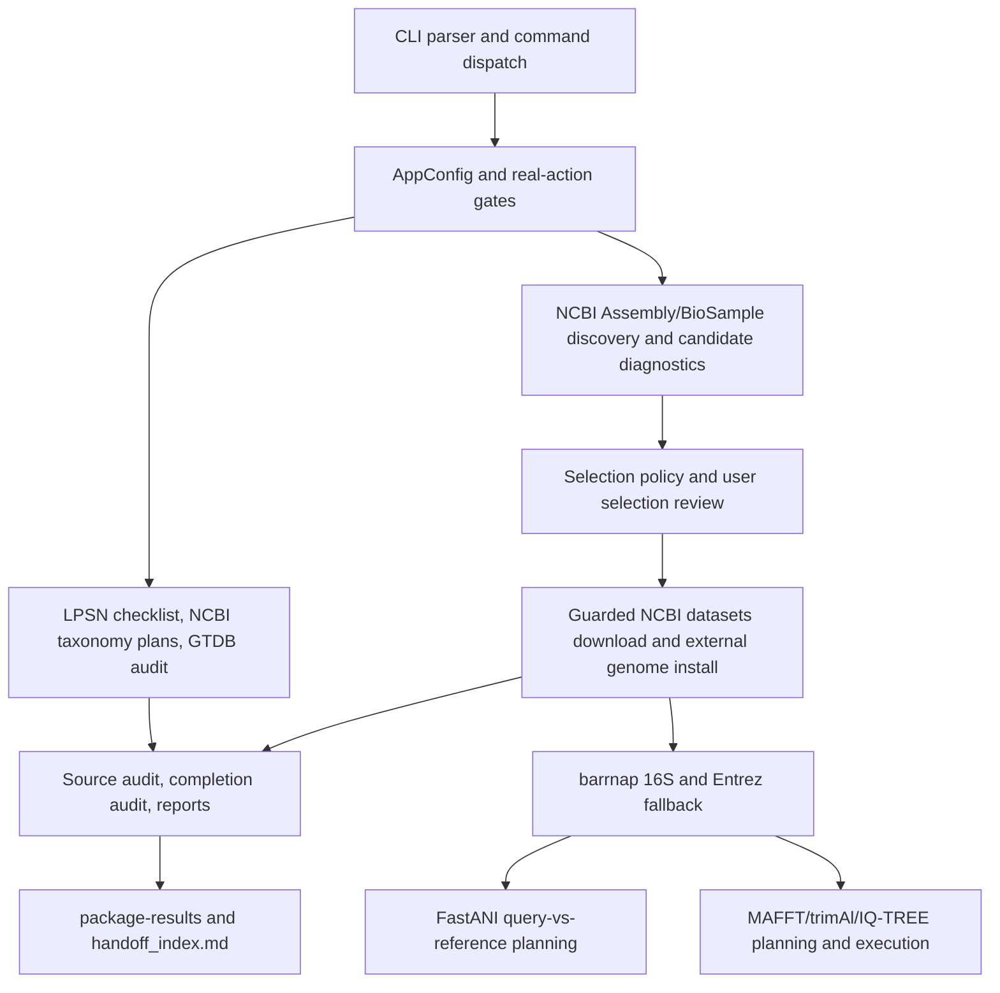

# TypeTreeFlow Architecture

TypeTreeFlow is an LPSN-first type-strain genome acquisition and audit
workflow. The architecture is organized around guarded command orchestration,
explicit run state, stable file contracts, and strict separation between
scientific evidence and operational planning.

## System Map

## CLI And Configuration

`typetreeflow.cli` owns parser construction, command normalization, argument
validation, and dispatch. Real actions are opt-in through explicit gates such
as `--enable-downloads`, `--enable-barrnap`, `--enable-entrez`,
`--enable-ncbi-discovery`, `--enable-fastani`, and `--enable-phylo`.
The maintained command surface includes `verify-genus`, `status`, `next-step`,
and `package-results`.

`AppConfig` centralizes runtime options, outdir/workspace resolution, email/API
configuration, dry-run behavior, resume/force semantics, and local query inputs.
Environment loading must not require reading private credential files during
ordinary maintenance.

## Workflow State And Paths

`workflow.paths` defines stable run paths. `workflow.state`, status summaries,
and next-step generation keep durable run state separate from compact stdout.
Cross-genus outdir reuse is blocked unless explicitly allowed. Resume reuses
compatible completed stages; force recomputes planned outputs.

## Taxonomy And Sources

LPSN-derived species checklist data defines the expected species universe and
type-strain tokens. NCBI taxonomy enrichment, GTDB metadata review, BioSample,
and discovery caches are supporting audit inputs. They do not override LPSN
correct-name/type-strain boundaries.

## Discovery, Selection, And Evidence

Assembly discovery writes candidate and diagnostic tables. Selection policy
ranks candidates and records evidence levels such as `strict_confirmed`,
`likely_type_material`, and `representative_only`, but strict type-strain
selection requires matching LPSN type-strain equivalence evidence.
Representative-only rows are useful for exploration and not strict
confirmations.

Completion and source audits report whether genomes and 16S records satisfy the
expected evidence scope. Expanded discovery creates review plans, result rows,
history, rejected candidates, and manual supplement hints; it does not mutate
manifest or completion metrics.

## Genome Acquisition

NCBI Assembly downloads are guarded and planned through `cache/ncbi/` outputs.
External genomes are local reviewed artifacts supplied through
`external_genomes.tsv`. Provider planning is separate and review-only; it never
downloads or installs provider files.

## rRNA, ANI, And Phylogeny

Same-genome barrnap extraction, Entrez fallback, FastANI, MAFFT, trimAl, and
IQ-TREE are separately gated. Fake runners and local fixtures cover tests.
Reports preserve provenance distinctions between same-genome 16S and fallback
16S.

## Reports, Diagnostics, And Delivery

Reports summarize status, evidence levels, completion gaps, fallback warnings,
and next actions. `package-results` copies available artifacts into a delivery
package. `handoff_index.md` helps navigation and operational handoff; it is not
a scientific decision source.

## Repository Layout

| Path | Responsibility |
| --- | --- |
| `.github/` | GitHub CI, templates, and community governance files. |
| `docs/` | Consolidated authoritative documentation only. |
| `scripts/` | Repository maintenance, checks, and release gates only. |
| `tests/` | Tests plus `tests/fixtures/` internal test data only. |
| `typetreeflow/` | Importable package and application code only. |

The repository intentionally keeps root `examples/`, `docs/archive/`,
repository-root `results/`, and `docs/audit/`, `docs/roadmap/`,
`docs/process/`, `docs/validation/` absent. Root `CODE_OF_CONDUCT.md`,
`CONTRIBUTING.md`, and `SECURITY.md` are also absent; governance files belong
under `.github/`.

`tests/fixtures/` is internal test data, not user examples. `examples/` is
intentionally absent; future user examples need a separate design and should not
be reserved with an empty directory.

Generated run outputs, downloaded archives, build products, release evidence,
and local credential files stay outside the repository workspace.
