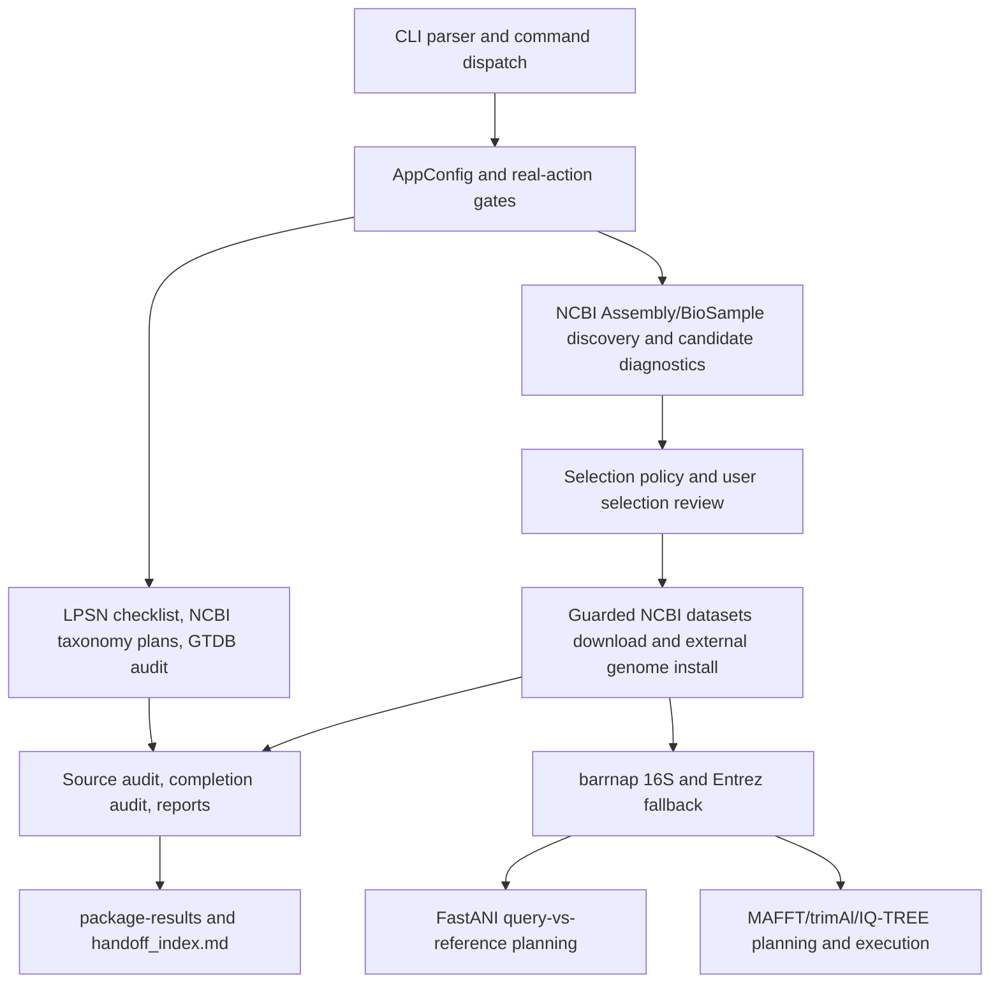

# TypeTreeFlow Architecture

TypeTreeFlow is an LPSN-first type-strain genome acquisition and audit
workflow. The architecture is organized around guarded command orchestration,
explicit run state, stable file contracts, and strict separation between
scientific evidence and operational planning.

## System Map

```mermaid
flowchart TD
  CLI["CLI parser and command dispatch"] --> Config["AppConfig and real-action gates"]
  Config --> Taxonomy["LPSN checklist, NCBI taxonomy plans, GTDB audit"]
  Config --> Discovery["NCBI Assembly/BioSample discovery and candidate diagnostics"]
  Discovery --> Selection["Selection policy and user selection review"]
  Selection --> Acquisition["Guarded NCBI datasets download and external genome install"]
  Acquisition --> Evidence["Source audit, completion audit, reports"]
  Acquisition --> RRNA["barrnap 16S and Entrez fallback"]
  RRNA --> ANI["FastANI query-vs-reference planning"]
  RRNA --> Phylo["MAFFT/trimAl/IQ-TREE planning and execution"]
  Evidence --> Delivery["package-results and handoff_index.md"]
  Taxonomy --> Evidence
```

## CLI And Configuration

`typetreeflow.cli` remains the stable public entry point for parser
construction, command normalization, argument validation, and dispatch. Focused
handlers under `typetreeflow.cli_handlers` own bounded dispatch surfaces such
as the ordered early-command registry, `package-results`, and report-only
refresh while preserving the `typetreeflow.cli.main` compatibility contract.
Real actions are opt-in through
explicit gates such as `--enable-downloads`, `--enable-barrnap`,
`--enable-entrez`, `--enable-ncbi-discovery`, `--enable-fastani`, and
`--enable-phylo`.
The maintained command surface includes `verify-genus`, `status`, `next-step`,
and `package-results`.
Within `verify-genus`, the reviewed-selection resume branch is handled before
ordinary manifest resume or acquisition replanning. It binds the submitted
selection bytes to a SHA-256 approval record and rechecks that binding before
the existing guarded download transition; the independent real-action gate
remains `--enable-downloads`. Without that gate, successful validation reuses
the selection dry-run projection to refresh selection-derived local state only;
it creates no approval and performs no download, provider, network, external
tool, or scientific-confirmation action. Projection state is transactionally
restored on failure and is independently validated before later approval or
diagnostic use. The exact marker fields, affected artifacts, rollback behavior,
and failure statuses are stable contracts defined in
[reference.md](reference.md), rather than a second architecture-level schema.
Terminal approval records remain immutable history rather than current
projection authorization; malformed or non-terminal records block before
writes. When the reviewed continuation also requests
`--extract-16s barrnap`, it continues through the existing guarded same-genome
16S stage after genome registration rather than ending at download. Offline
BioSample input used to enrich the checkpoint is normalized into the
run-local cache, so the reviewed continuation and final reconciler retain that
supporting evidence without requiring the curator to repeat input arguments.
Resume never substitutes a newly supplied external BioSample cache. Candidate
assembly-to-BioSample linkage is injected only when the non-empty accession set
is unique; ambiguous sets produce a reconciler diagnostic and no linkage.
The small approval component also binds genus,
absolute outdir, and the fixed selection artifact, and owns the single
`authorized`/`running`/terminal lifecycle used by CLI and run-state projection.
Each new approval has an attempt identifier and may carry one compact prior
attempt snapshot. Status diagnostics reuse the same validator before
trusting persisted run state; they do not maintain a parallel approval log.
The same bounded snapshot may represent an orphan `authorized` or `running`
attempt only with its matching abandonment/recovery marker; nested history is
rejected.

Small isolated adapters such as `manual-review`, `strict-gating`, `readiness`,
`curator-packet`, `strict-gate-state`, `archive-candidates`,
`acquisition-worklist`, `coverage-plan`, `provider-handoff`,
`provider-request`, and
`count-crosswalk` are dispatched before full workflow configuration is loaded.
They emit compact JSON for AI operators and remain outside workflow mutation,
provider access, downloads, and external-tool execution.

`typetreeflow.cli_recognizer` provides side-effect-free, JSON-serializable
command metadata for AI/helper-facing tooling. `typetreeflow commands catalog`,
`typetreeflow commands recognize`, `typetreeflow commands render`,
`typetreeflow commands plan`, and `typetreeflow commands preflight` expose
static command-surface metadata, argv-shape recognition, structured request to
argv rendering, and conservative allow/block planning through isolated
compact-JSON adapters. They do not run command-specific argparse dispatch,
load configuration, read environment files, execute commands, write outputs, or
act as dispatch or approval authority; the existing CLI parser and dispatch
order remain authoritative.

`AppConfig` centralizes runtime options, outdir/workspace resolution, email/API
configuration, dry-run behavior, resume/force semantics, and local query inputs.
Environment loading must not require reading private credential files during
ordinary maintenance.

## Workflow State And Paths

`workflow.paths` defines stable run paths. `workflow.state`, status summaries,
and next-step generation keep durable run state separate from compact stdout.
Cross-genus outdir reuse is blocked unless explicitly allowed. Resume reuses
compatible completed stages; force recomputes planned outputs.

## Taxonomy And Sources

LPSN-derived species checklist data defines the expected species universe and
type-strain tokens. NCBI taxonomy enrichment, GTDB metadata review, BioSample,
and discovery caches are supporting audit inputs. They do not override LPSN
correct-name/type-strain boundaries.

## Discovery, Selection, And Evidence

Assembly discovery writes candidate and diagnostic tables. Selection policy
ranks candidates and records evidence levels such as `strict_confirmed`,
`likely_type_material`, and `representative_only`, but strict type-strain
selection requires matching LPSN type-strain equivalence evidence.
Representative-only rows are useful for exploration and not strict
confirmations.

Completion and source audits report whether genomes and 16S records satisfy the
expected evidence scope. Expanded discovery creates review plans, result rows,
history, rejected candidates, and manual supplement hints; it does not mutate
manifest or completion metrics.

## Genome Acquisition

NCBI Assembly downloads are guarded and planned through `cache/ncbi/` outputs.
External genomes are local reviewed artifacts supplied through
`external_genomes.tsv`. Provider planning is separate and review-only; it never
downloads or installs provider files.

## rRNA, ANI, And Phylogeny

Same-genome barrnap extraction, Entrez fallback, FastANI, MAFFT, trimAl, and
IQ-TREE are separately gated. Fake runners and local fixtures cover tests.
Reports preserve provenance distinctions between same-genome 16S and fallback
16S.

## Reports, Diagnostics, And Delivery

Reports summarize status, evidence levels, completion gaps, fallback warnings,
and next actions. `package-results` copies available artifacts into a delivery
package. Report-inclusive packages preserve existing per-species completion
audit, summary, and gap tables under `source_audit/` and `completion/`, while
missing artifacts remain explicitly missing rather than becoming empty tables.
They also retain available expanded-discovery results/history, rejected
candidates, and manual supplement hints under `completion/` so a successful
download path does not erase unresolved review evidence. Inclusion is gated by
the current identity-matched final run state's explicit
`enable_expanded_discovery=true`; stale files alone cannot enable delivery.
These files are scoped as completion evidence, not strict scientific
deliverables. Reconciler audit mapping retains a sole unselected candidate for
candidate/conflict diagnosis when no row was selected, without adding it to the
manifest or download plan. Status and next-step project the existing audit into
a compact read-only scientific-gap summary with closed complete, conflict,
missing, insufficient-linkage, candidate, representative, and unknown classes.
Delivery README and handoff text label aggregate strict, non-strict candidate,
conflict, and missing counts while directing readers to row-level tier/linkage
for the specific reason and review route. Successful package execution remains
separate from scientific completeness.
`handoff_index.md` helps navigation and operational handoff; it is not a
scientific decision source.

## Repository Layout

| Path | Responsibility |
| --- | --- |
| `.github/` | GitHub CI, templates, and community governance files. |
| `docs/` | Consolidated authoritative documentation only. |
| `scripts/` | Repository maintenance, checks, and release gates only. |
| `tests/` | Tests plus `tests/fixtures/` internal test data only. |
| `typetreeflow/` | Importable package and application code only. |

The repository intentionally keeps root `examples/`, `docs/archive/`,
repository-root `results/`, and `docs/audit/`, `docs/roadmap/`,
`docs/process/`, `docs/validation/` absent. Root `CODE_OF_CONDUCT.md`,
`CONTRIBUTING.md`, and `SECURITY.md` are also absent; governance files belong
under `.github/`.

`tests/fixtures/` is internal test data, not user examples. `examples/` is
intentionally absent; future user examples need a separate design and should not
be reserved with an empty directory.

Generated run outputs, downloaded archives, build products, release evidence,
and local credential files stay outside the repository workspace.
